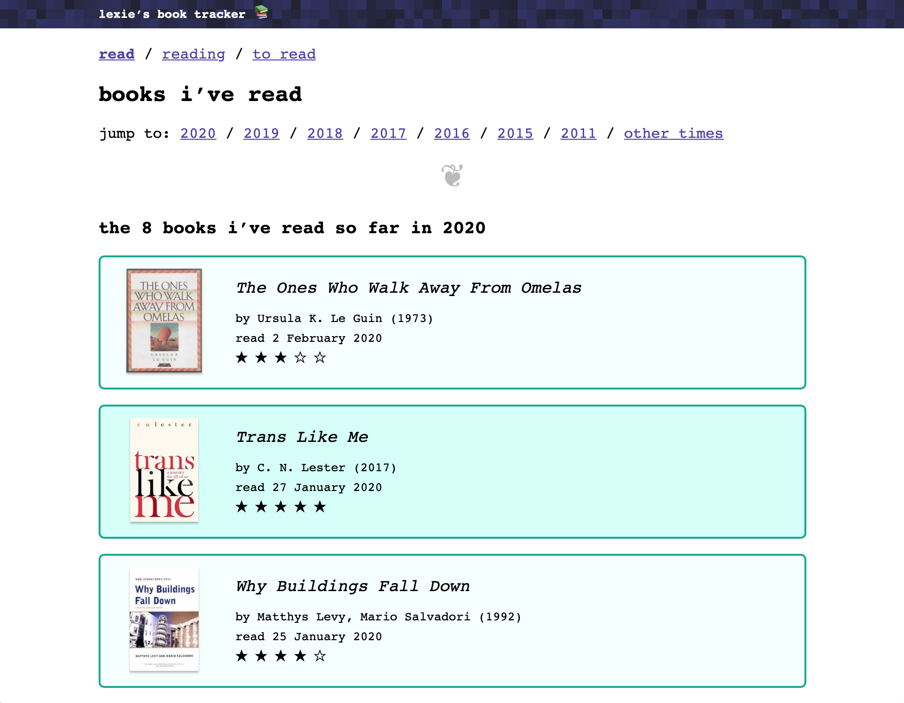

# books.alexwlchan.net

[](https://github.com/alexwlchan/books.alexwlchan.net/actions/workflows/build_site.yml)

This is the source code for <https://books.alexwlchan.net>, a site I use to track the books I've read.
It creates bright, colourful cards for each book, with a tint colour based on the book's cover.
Each card links to a longer, more detailed review.



This repo contains my reviews, the cover images, and the Rust tool that creates the site.


## How I store my reviews

Individual reviews are stored as plaintext files in the `src` directory, one per book I've read.
Here's an example:

```
---
book:
  contributors:
    - name: Susanna Clarke
  cover:
    name: piranesi.jpg
    size: 1992812
    tint_color: "#916540"
  publication_year: "2020"
  title: Piranesi
review:
  date_read: 2022-01-20
  rating: 5
---

This is a weird but delightful book.
```

Each book also has a cover image in the `covers` directory.

These files get fed into a static site generator that creates HTML files.


## Key tools

The site uses:

*   [Jekyll][jekyll], which generates the HTML pages
*   [GitHub Actions][github_actions], which builds and deploys the site
*   [Netlify], which hosts the site

[jekyll]: https://jekyllrb.com/
[github_actions]: https://github.com/features/actions
[Netlify]: https://www.netlify.com


## Motivation

I want a good way to track my books -- both to help me remember what I've read, and so I think more about why I like the books I do.

I've tried Goodreads and a couple of other sites, but they don't really work for me -- they emphasise more social features than book tracking, and I can't be as nit picky with the details as I'd like.

Building my own site allows me to be very picky, which is particularly useful for book covers.
I find covers easy to remember -- I may not know a book if you tell me the title, but show me the cover and you'll get instant recognition.
Being able to pick the covers (and then tint the site around them) really works for me.
